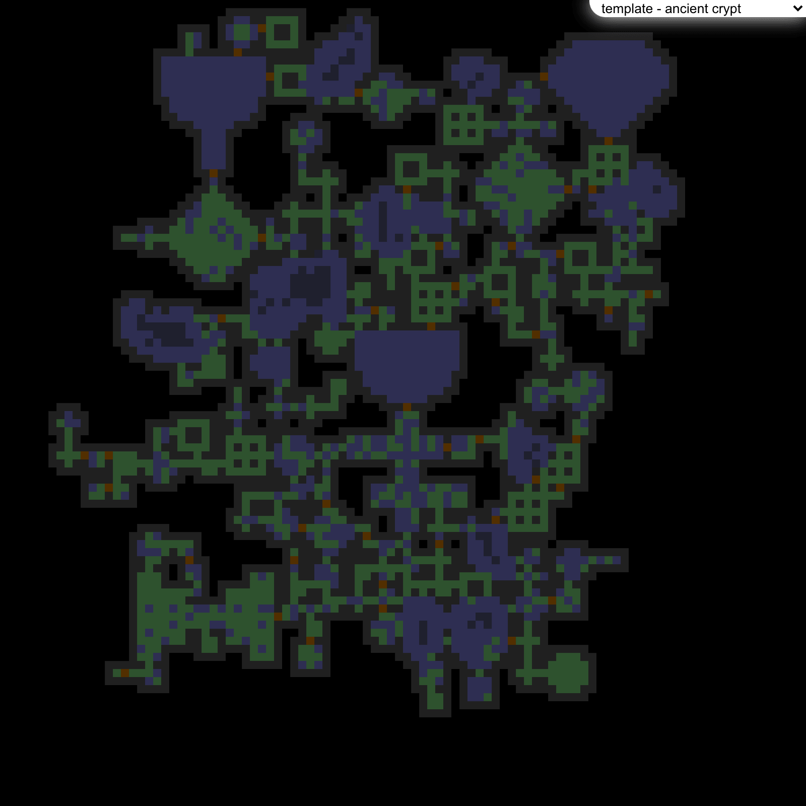
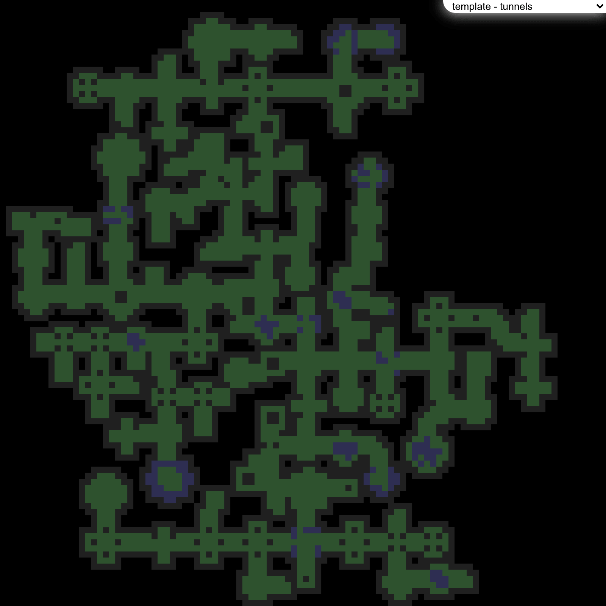
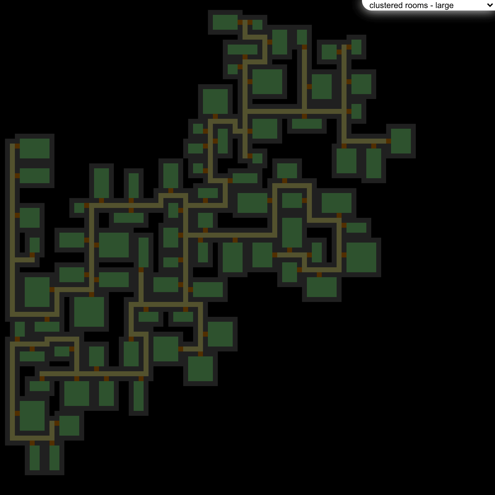
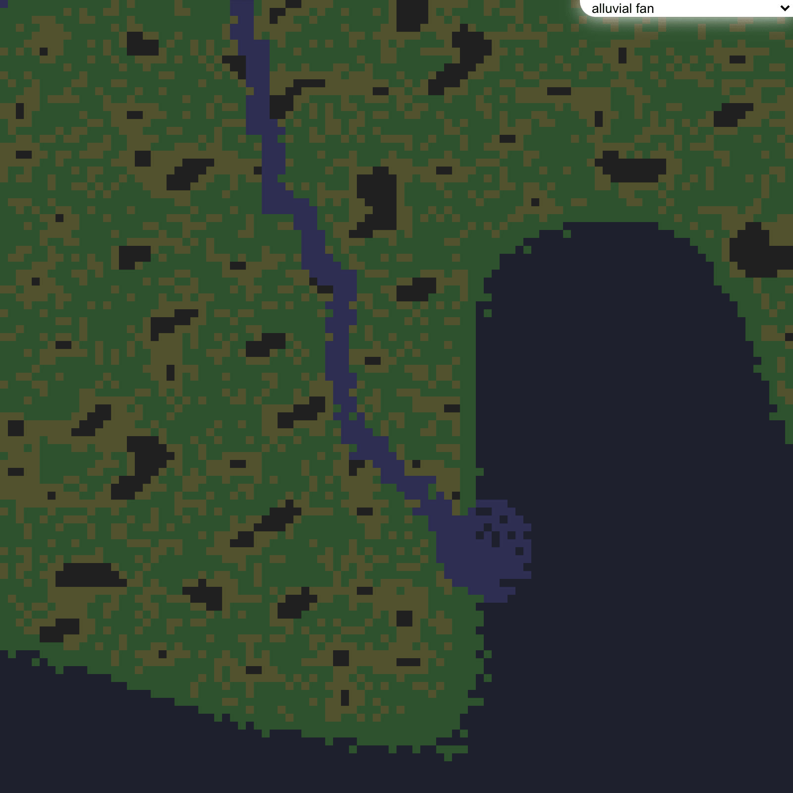
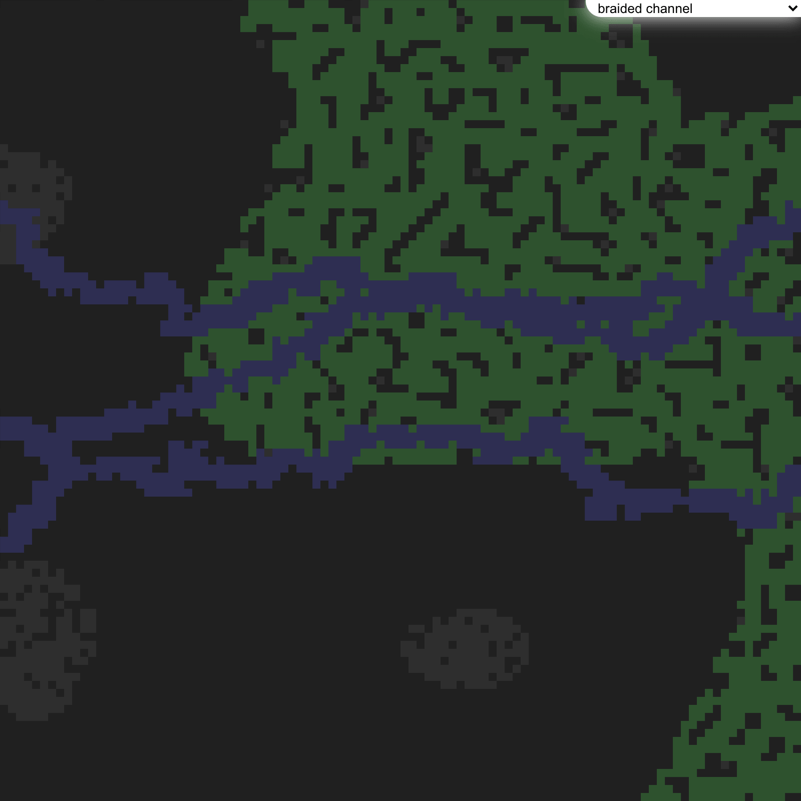
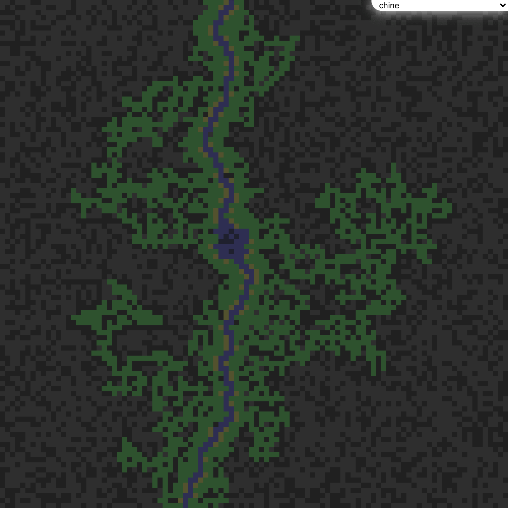
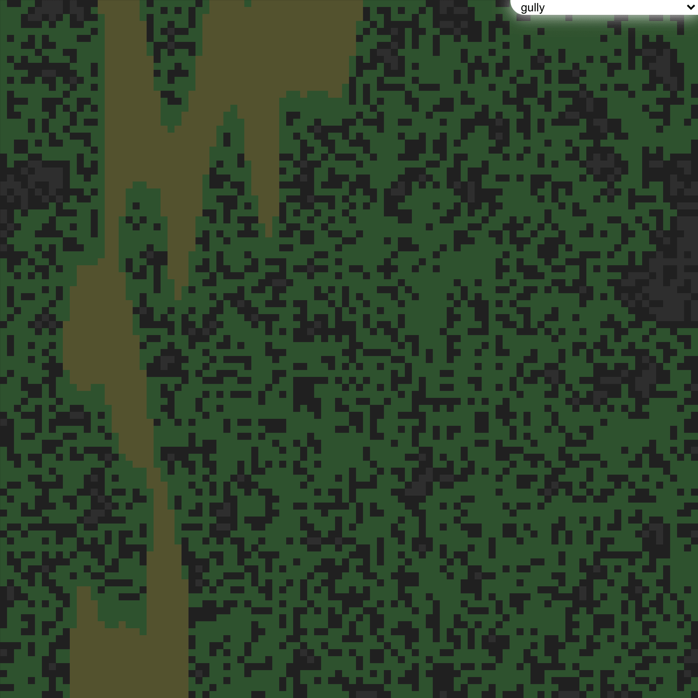

# compass
JavaScript mapping classes and random generation algorithms	JavaScript mapping classes and random generation algorithms


## Table of Contents
- [Setup](#setup)
- [Usage](#usage)
  - [WebGL Canvas](#webgl-canvas)
  - [2d Canvas](#2d-canvas)
- [Examples](#examples)
  - [Templates](#templates)
    - [Template - Ancient Crypt](#template---ancient-crypt)
    - [Template - Basic](#template---basic)
    - [Template - Caverns](#template---caverns)
    - [Template - Crypt Catacombs](#template---crypt-catacombs)
    - [Template - Marsh](#template---marsh)
    - [Template - Passages](#template---passages)
    - [Template - Standard Crypt](#template---standard-crypt)
    - [Template - Tunnels](#template---tunnels)
  - [Basic](#basic)
    - [Clustered Rooms - Default](#clustered-rooms---default)
    - [Clustered Rooms - Small](#clustered-rooms---small)
    - [Clustered Rooms - Large](#clustered-rooms---large)
    - [Clustered Rooms - Long Hallways](#clustered-rooms---long-hallways)
    - [Clustered Rooms - Wild](#clustered-rooms---wild)
    - [Clustered Rooms - Winding](#clustered-rooms-winding)
    - [Diffuse Corridors - Default](#diffuse-corridors---default)
    - [Diffuse Corridors - Catacombs](#diffuse-corridors---catacombs)
    - [Diffuse Corridors - Connected](#diffuse-corridors---connected)
    - [Diffuse Corridors - Deadends](#diffuse-corridors---deadends)
    - [Diffuse Corridors - External](#diffuse-corridors---external)
    - [Diffuse Corridors - Separated](#diffuse-corridors---separated)
    - [Organized Rooms](#organized-rooms)
    - [Patterned Rooms](#patterned-rooms)
  - [Landforms](#landforms)
    - [Alluvial fan](#alluvial-fan)
    - [Arroyo](#arroyo)
    - [Bornhardt](#bornhardt)
    - [Braided Channel](#braided-channel)
    - [Butte](#butte)
    - [Caldera](#caldera)
    - [Caverns](#caverns)
    - [Chine](#chine)
    - [Cliffs](#cliffs)
    - [Couloir](#couloir)
    - [Cuesta](#cuesta)
    - [Draw](#draw)
    - [Hogback](#hogback)
    - [Esker](#esker)
    - [Exhumed River Channel](#exhumed-river-channel)
    - [Fjord](#fjord)
    - [Floodplain](#floodplain)
    - [Glen](#glen)
    - [Gulch](#gulch)
    - [Gully](#gully)
    - [Marsh](#marsh)
    - [Meander](#meander)
    - [Mesa](#mesa)
    - [Mogote](#mogote)
    - [Ravine](#ravine)
    - [Strath](#strath)
    - [Tepui](#tepui)
    - [Turlough](#turlough)
    - [Uvala](#uvala)
    - [Wadi](#wadi)
## Setup
Getting started is as easy as `npm i @ion-cloud/compass --save` and then `importing` the required modules into your app with `import {Map,Sector,maps} from '@ion-cloud/compass'`. 

Please see code example [here](https://github.com/ion-cloud/compass/blob/master/demo/src/index.js).

## Usage
### WebGL Canvas
```
import {EaselWebGL} from '@ion-cloud/easel';
import {Map,maps,BasicWebGLDisplay} from '@ion-cloud/compass';

const easel = new EaselWebGL(),
      map = new Map({width:100,height:100}),
      display = new BasicWebGLDisplay({easel,map}),
      {generator} = maps.find(map=> map.name==='template - basic');

generator({map});
easel.onDraw = function(){ display.draw(); };
easel.redraw();
```
### 2d Canvas
```
import {Easel} from '@ion-cloud/core';
import {Map,maps,BasicDisplay} from '@ion-cloud/compass';

const easel = new Easel(),
      map = new Map({width:100,height:100}),
      display = new BasicDisplay({easel,map}),
      {generator} = maps.find(map=> map.name==='template - basic');

generator({map});
easel.onDraw = function(){ display.draw(); };
easel.redraw();
```
## Examples
### Templates
#### Template - Ancient Crypt

#### Template - Basic

#### Template - Caverns

#### Template - Crypt Catacombs

#### Template - Marsh

#### Template - Passages

#### Template - Standard Crypt

#### Template - Tunnels

### Basic
#### Clustered Rooms - Default

#### Clustered Rooms - Small

#### Clustered Rooms - Large

#### Clustered Rooms - Long Hallways

#### Clustered Rooms - Wild

#### Clustered Rooms - Winding

#### Diffuse Corridors - Default

#### Diffuse Corridors - Catacombs

#### Diffuse Corridors - Connected

#### Diffuse Corridors - Deadends

#### Diffuse Corridors - External

#### Diffuse Corridors - Separated

#### Organized Rooms

#### Patterned Rooms

### Landforms
#### Alluvial Fan

#### Arroyo

#### Bornhardt

#### Braided Channel

#### Butte

#### Caldera

#### Caverns

#### Chine

#### Cliffs

#### Couloir

#### Cuesta

#### Draw

#### Hogback

#### Esker

#### Exhumed River Channel

#### Fjord

#### Floodplain

#### Glen

#### Gulch

#### Gully

#### Marsh

#### Meander

#### Mesa

#### Mogote

#### Ravine

#### Strath

#### Tepui

#### Turlough

#### Uvala

#### Wadi

