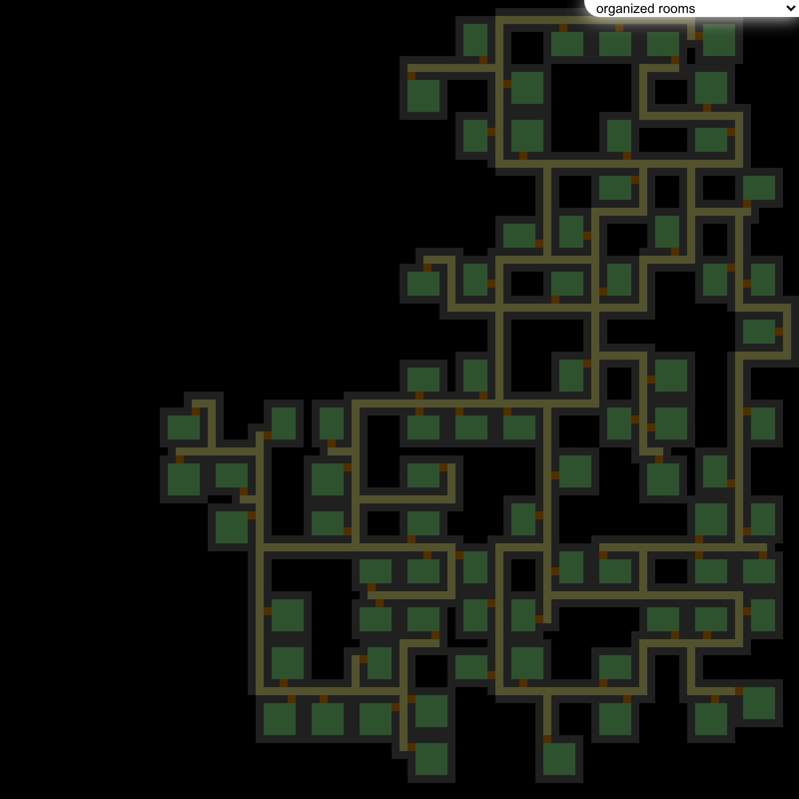
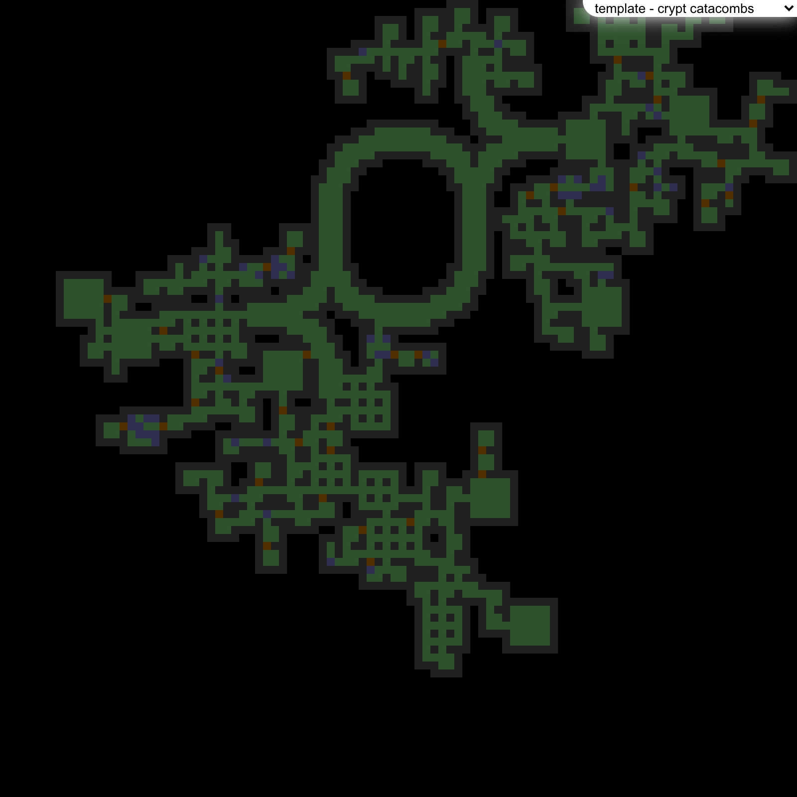
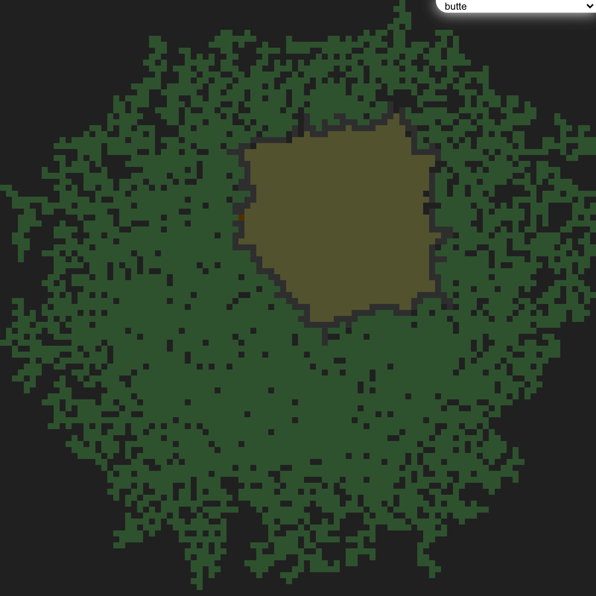
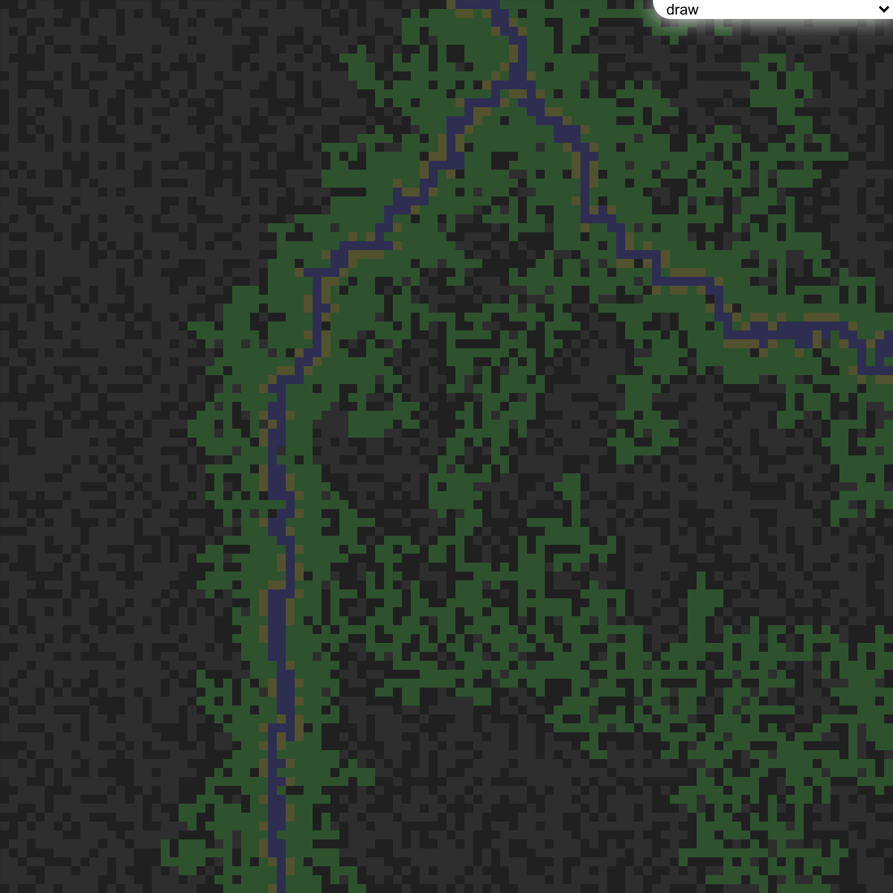
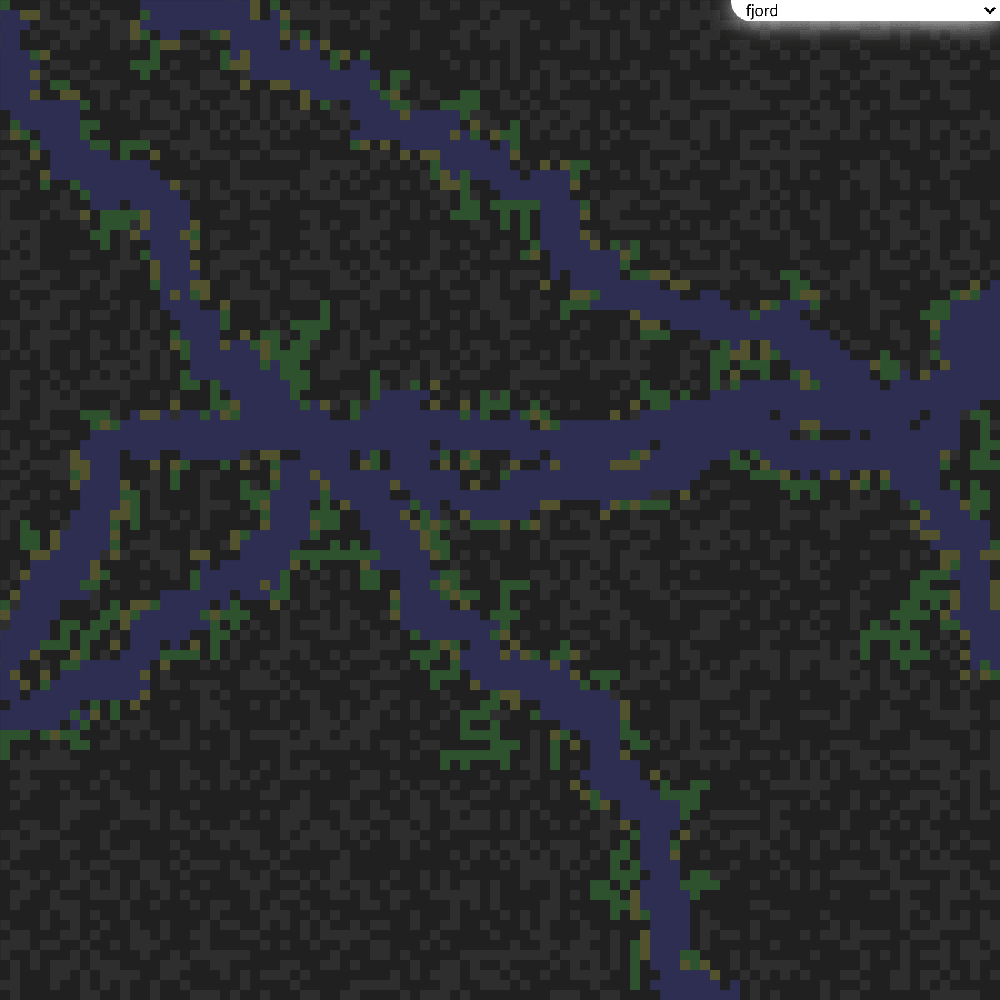
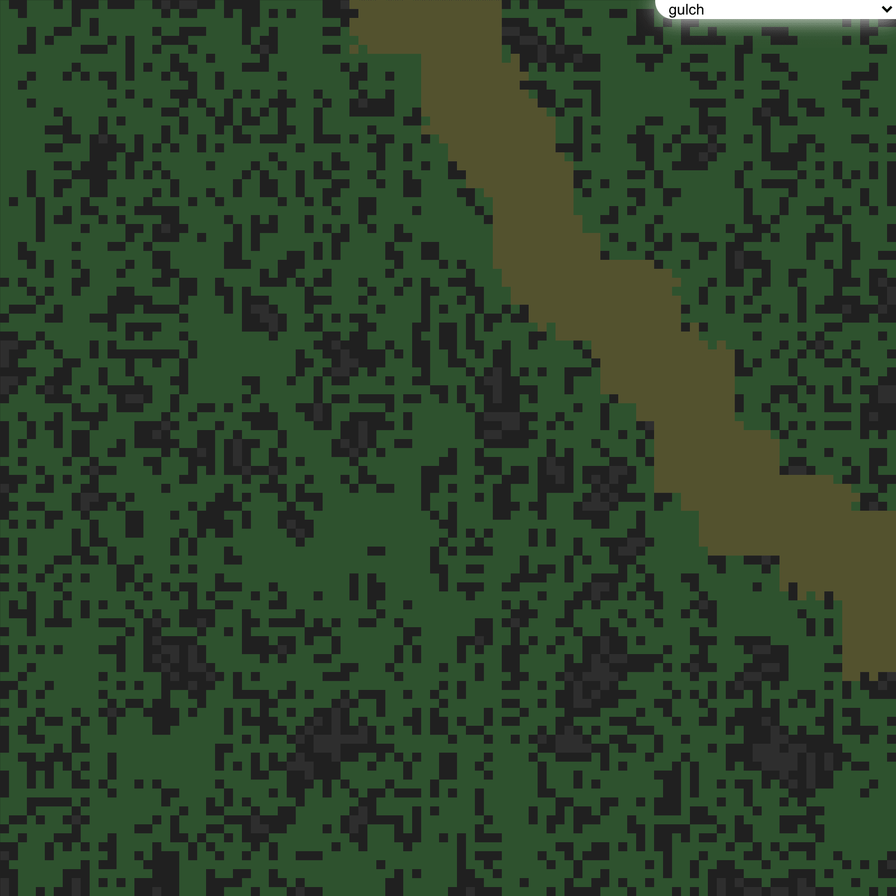
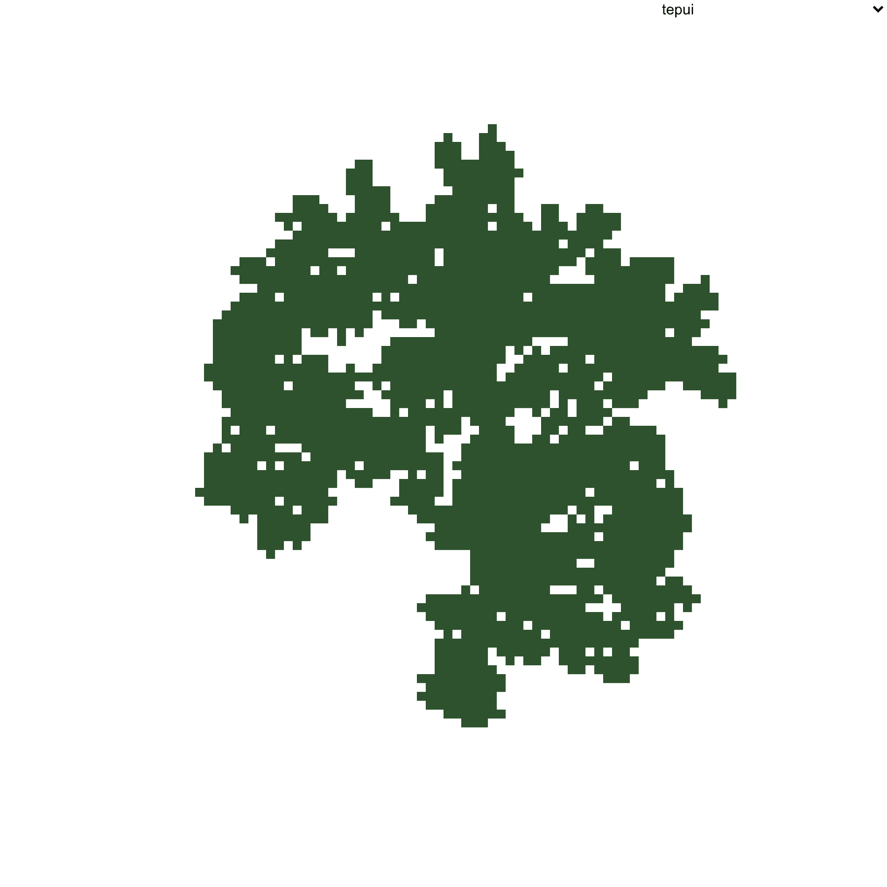

# compass
JavaScript mapping classes and random generation algorithms	JavaScript mapping classes and random generation algorithms


## Setup
Getting started is as easy as `npm i @ion-cloud/compass --save` and then `importing` the required modules into your app with `import {Map,Sector,maps} from '@ion-cloud/compass'`. 

Please see code example [here](https://github.com/ion-cloud/compass/blob/master/demo/src/index.js).

## Usage
```
import {Easel,Map,Sector,maps} from '@ion-cloud/core';
export const easel = new Easel();

const map = new Map(50,50),
      arroyo = maps.find(map=> map.name==='arroyo');

for(let y=0;y<map.height;y++){
  map.sectors[y]=[];
  for(let x=0;x<map.width;x++){
    map.sectors[y][x]=new Sector({x,y,map});
  } //end for
} //end for
arroyo.generator({map});
easel.onDraw = function(){
  const rh = easel.viewport.h/map.height, rw = easel.viewport.w/map.width;

  map.sectors.forEach((row,y)=>{
    row.forEach((sector,x)=>{
      if(sector.isEmpty()){
        easel.ctx.fillStyle='#000';
      }else if(sector.isRemoved()){
        easel.ctx.fillStyle='#833';
      }else if(sector.isDoor()){
        easel.ctx.fillStyle='#b94';
      }else if(sector.isWallSpecial()){
        easel.ctx.fillStyle='#445';
      }else if(sector.isWall()){
        easel.ctx.fillStyle='#334';
      }else if(sector.isWaterSpecial()){
        easel.ctx.fillStyle='#339';
      }else if(sector.isWater()){
        easel.ctx.fillStyle='#33b';
      }else if(sector.isFloorSpecial()){
        easel.ctx.fillStyle='#563';
      }else if(sector.isFloor()){
        easel.ctx.fillStyle='#373';
      }else{ //unknown
        easel.ctx.fillStyle='#f00';
      } //end if

      // the -0.4 & +0.8 is to remove sub-pixel issues
      // that might cause lines to appear between cells
      easel.ctx.fillRect(x*rw+0.4,y*rh+0.4,rw+0.8,rh+0.8);
    });
  });
};
easel.redraw();
```
## Examples
### Basic
#### Clustered Rooms

#### Organized Rooms

#### Patterned Rooms

### Templates
#### Template - Ancient Crypt

#### Template - Basic

#### Template - Caverns

#### Template - Crypt Catacombs

#### Template - Marsh

#### Template - Passages

#### Template - Standard Crypt

#### Template - Tunnels

### Landforms
#### Alluvial Fan

#### Arroyo

#### Bornhardt

#### Braided Channel

#### Butte

#### Caldera

#### Caverns

#### Chine

#### Cliffs

#### Couloir

#### Cuesta

#### Draw

#### Hogback

#### Esker

#### Exhumed River Channel

#### Fjord

#### Floodplain

#### Glen

#### Gulch

#### Gully

#### Marsh

#### Mogote

#### Ravine

#### Strath

#### Tepui

#### Turlough

#### Uvala

#### Wadi

