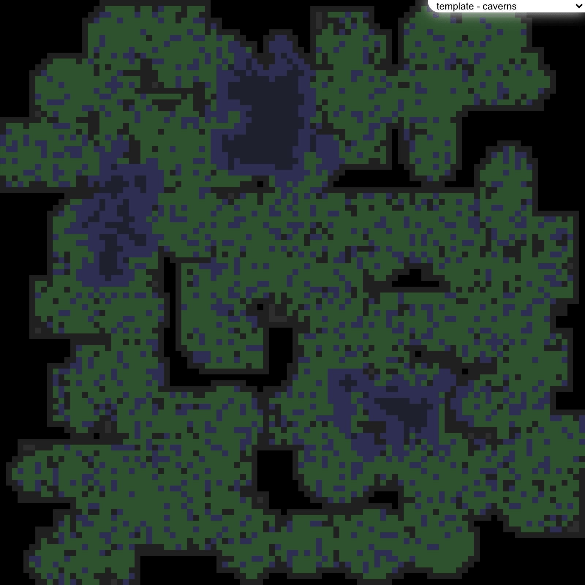
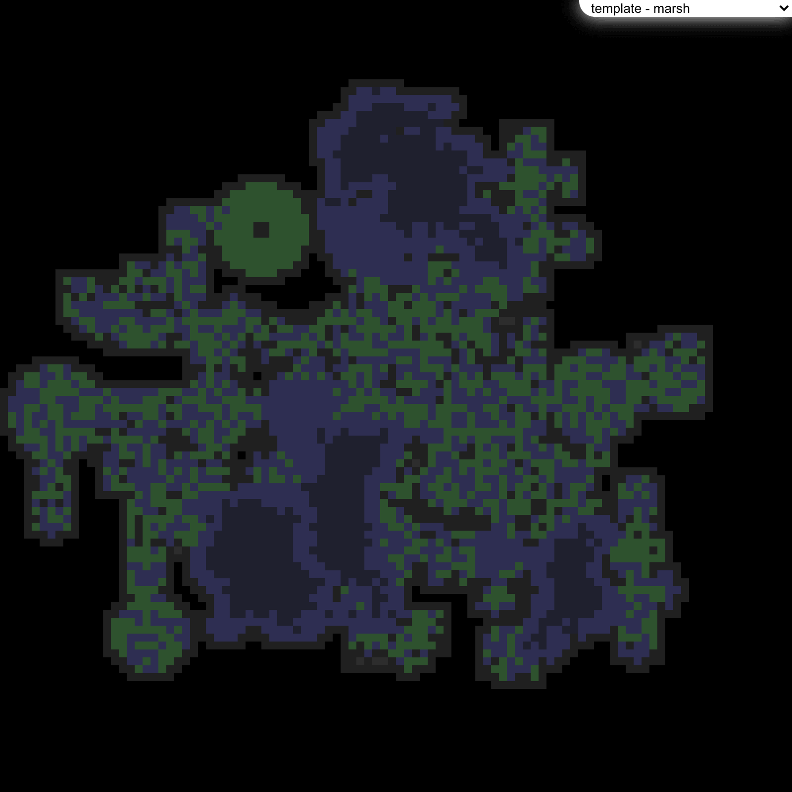
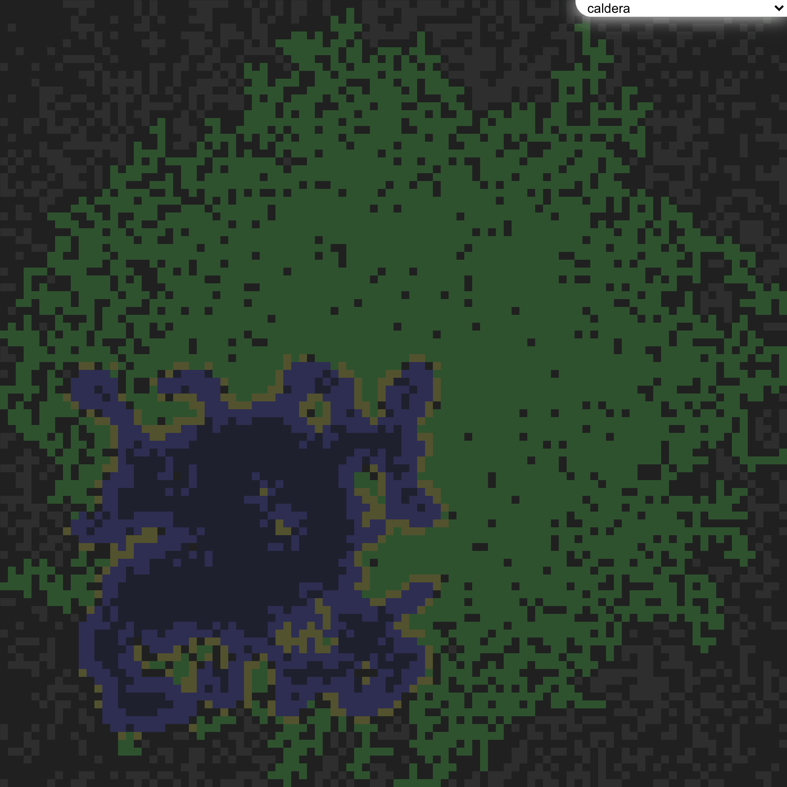
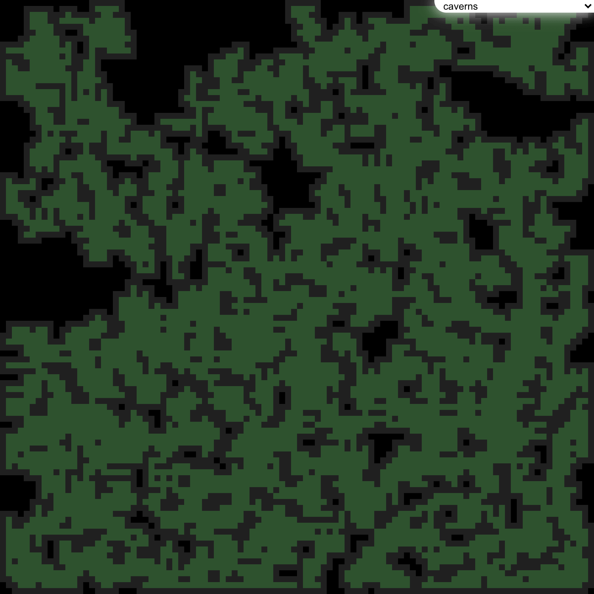
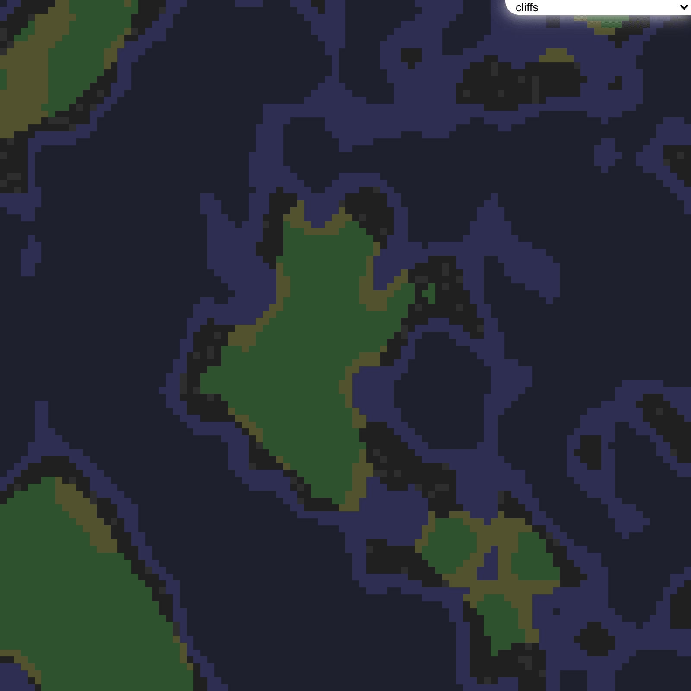
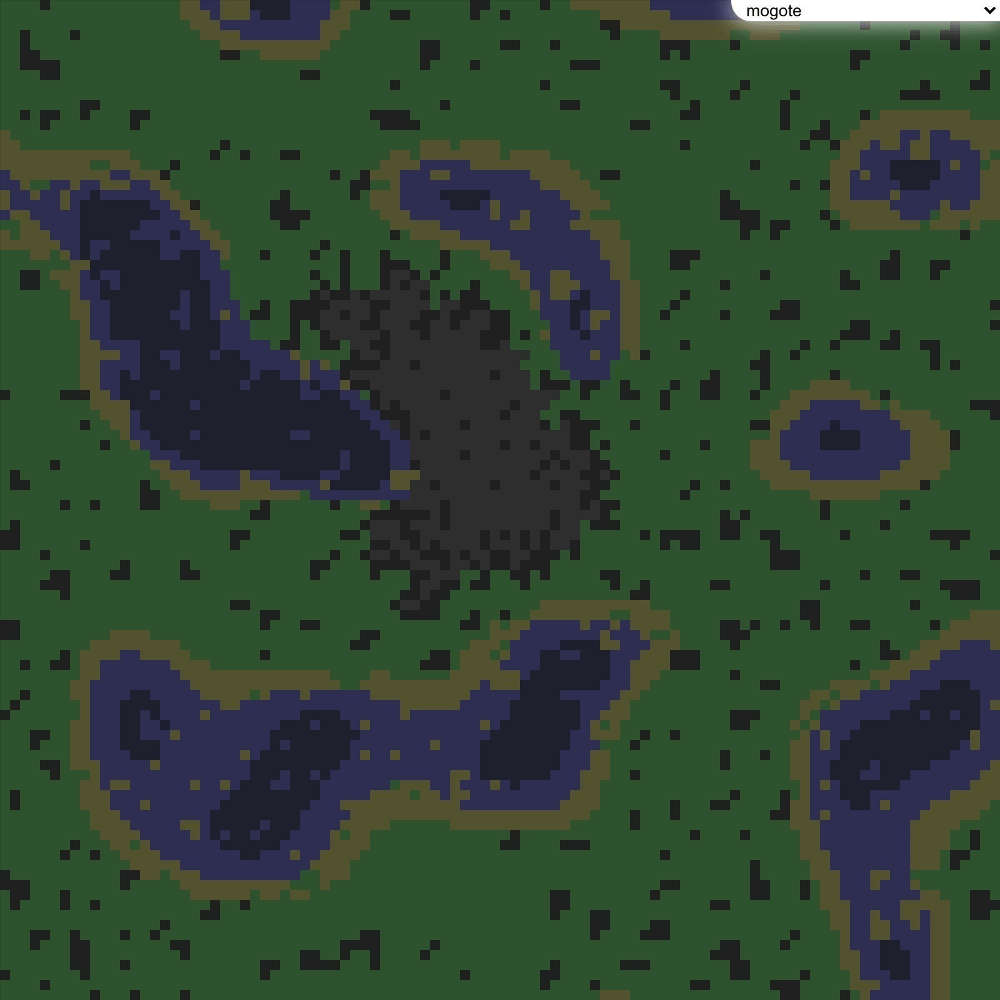
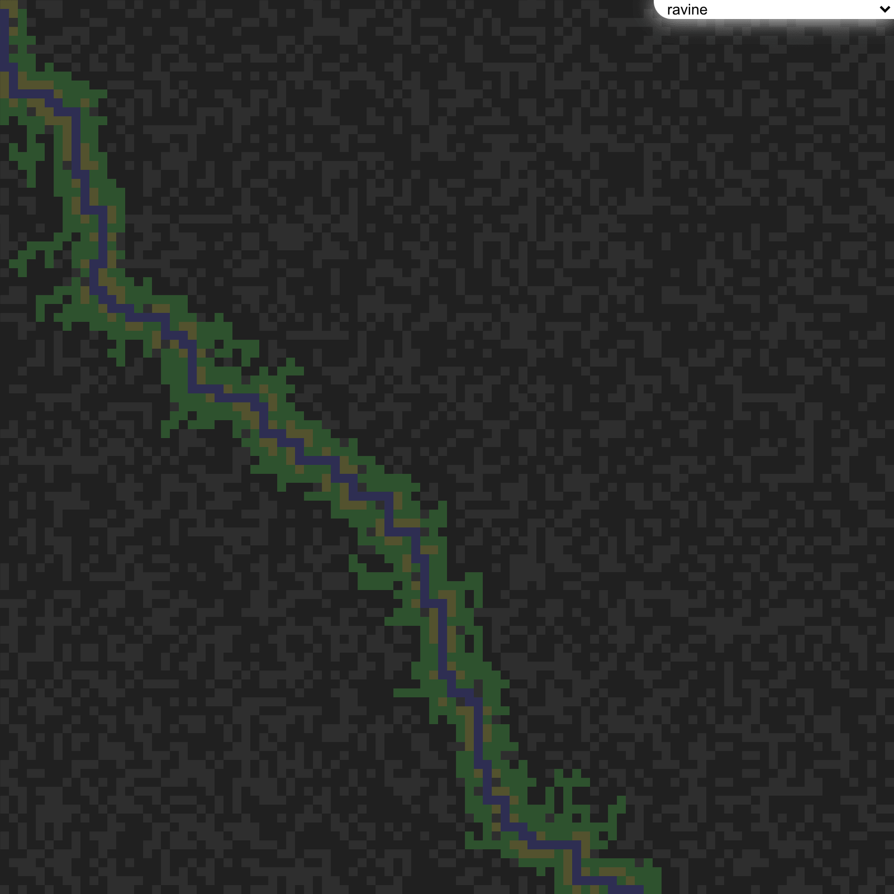
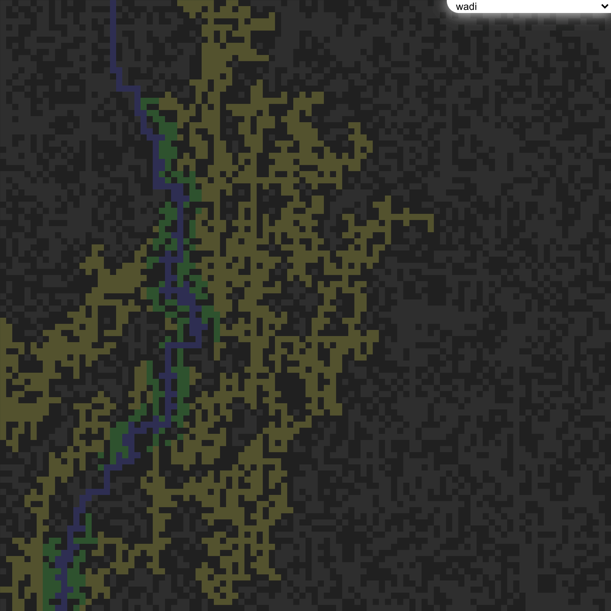

# compass
JavaScript mapping classes and random generation algorithms	JavaScript mapping classes and random generation algorithms


## Setup
Getting started is as easy as `npm i @ion-cloud/compass --save` and then `importing` the required modules into your app with `import {Map,Sector,maps} from '@ion-cloud/compass'`. 

Please see code example [here](https://github.com/ion-cloud/compass/blob/master/demo/src/index.js).

## Usage
```
import {EaselWebGL} from '@ion-cloud/easel';
import {Map,Sector,maps} from '@ion-cloud/compass';

const easel = new EaselWebGL(),
      map = new Map({width:100,height:100}),
      {generator} = maps.find(map=> map.name==='template - caverns');

generator({map});

easel.onDraw = function(){
  const h = 1/(map.height-1),
        w = 1/(map.width-1),
        l1 = 0.12,
        l2 = 0.18,
        l3 = 0.32;

  let color;

  map.sectors.getAll().forEach(sector=>{
    const {x,y} = sector;

    if(sector.isEmpty()||sector.isVoid()){
      color = [0.0,0.0,0.0,1.0];
    }else if(sector.isRemoved()){
      color = [l3,l1,l1,1.0];
    }else if(sector.isDoor()){
      color = [l3,l2,0.0,1.0];
    }else if(sector.isWallSpecial()){
      color = [l2,l2,l2,1.0];
    }else if(sector.isWall()){
      color = [l1,l1,l1,1.0];
    }else if(sector.isWaterSpecial()){
      color = [l1,l1,l2,1.0];
    }else if(sector.isWater()){
      color = [l2,l2,l3,1.0];
    }else if(sector.isFloorSpecial()){
      color = [l3,l3,l2,1.0];
    }else if(sector.isFloor()){
      color = [l2,l3,l2,1.0];
    }else{ //unknown
      color = [1.0,0.0,0.0,1.0];
    } //end if
    easel.fillRect({x:x/map.width,y:y/map.height,w,h,c:color});
  });
};
easel.redraw();
```
## Examples
### Basic
#### Clustered Rooms

#### Organized Rooms

#### Patterned Rooms

### Templates
#### Template - Ancient Crypt

#### Template - Basic

#### Template - Caverns

#### Template - Crypt Catacombs

#### Template - Marsh

#### Template - Passages

#### Template - Standard Crypt

#### Template - Tunnels

### Landforms
#### Alluvial Fan

#### Arroyo

#### Bornhardt

#### Braided Channel

#### Butte

#### Caldera

#### Caverns

#### Chine

#### Cliffs

#### Couloir

#### Cuesta

#### Draw

#### Hogback

#### Esker

#### Exhumed River Channel

#### Fjord

#### Floodplain

#### Glen

#### Gulch

#### Gully

#### Marsh

#### Mogote

#### Ravine

#### Strath

#### Tepui

#### Turlough

#### Uvala

#### Wadi

